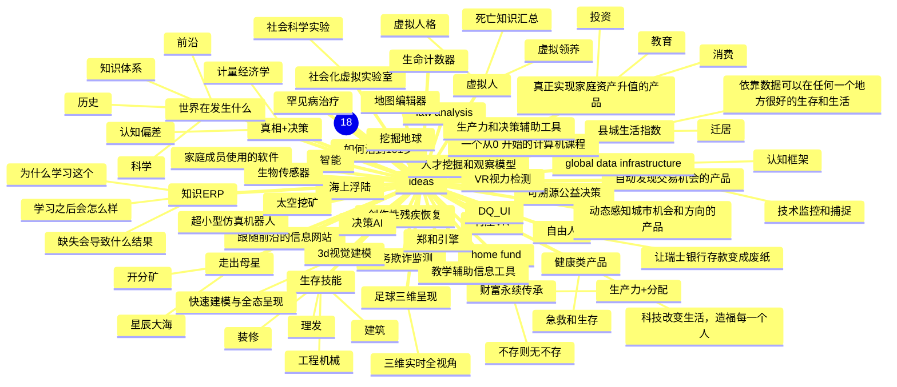

# doc

```mermaid
mindmap
  root((18))
    ideas
        健康类产品
            科技改变生活，造福每一个人
            急救和生存
        自动发现交易机会的产品
            技术监控和捕捉
        人才挖掘和观察模型
        财富永续传承
            不存则无不存
            生产力+分配
        财务欺诈监测
        虚拟人
            死亡知识汇总
            虚拟领养
            虚拟人格
        创伤性残疾恢复
        海上浮陆
        可溯源公益决策
        如何活到101岁
        global data infrastructure
            认知框架
        自由人
            让瑞士银行存款变成废纸
        走出母星
            星辰大海
            开分矿
        足球三维呈现
            三维实时全视角
        真相+决策
            认知偏差
            计量经济学
        VR视力检测
        社会化虚拟实验室
            社会科学实验
        生存技能
            建筑
            装修
            理发
            工程机械
        罕见病治疗
        县城生活指数
            迁居
            依靠数据可以在任何一个地方很好的生存和生活
        一个从0 开始的计算机课程
        世界在发生什么
            历史
            前沿
            科学
            知识体系
        home fund
        law analysis
        村庄VR
        生命计数器
        跟随前沿的信息网站
        生产力和决策辅助工具
        教学辅助信息工具
        地图编辑器
        挖掘地球
        家庭成员使用的软件
        真正实现家庭资产升值的产品
            教育
            投资
            消费
        动态感知城市机会和方向的产品
        3d视觉建模
            快速建模与全态呈现
        超小型仿真机器人
        智能
        生物传感器
        太空挖矿
        知识ERP
            为什么学习这个
            学习之后会怎么样
            缺失会导致什么结果
        决策AI
        郑和引擎
        DQ_UI
```
